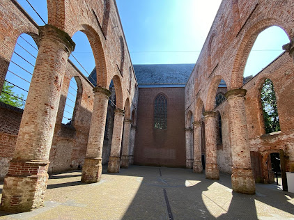
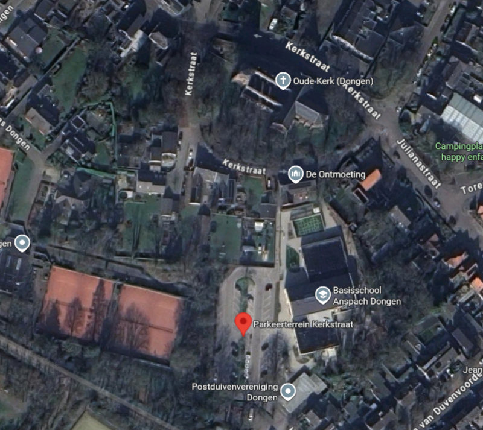

# 💍 Bruiloft van Wietze & Charlotte

Welkom op onze bruiloftspagina — wat leuk dat je een kijkje neemt!  
Op deze site vind je alle informatie rondom onze grote dag.  
We updaten de site regelmatig, dus kom gerust nog eens terug.

## Parkeren
Parkeren kan bij Parkeerterrein Kerkstraat, gelieve niet parkeren bij de kerk zelf! Adres voor het parkeerterein is <a href="https://maps.app.goo.gl/Kj5SpMmNk5Asgq447" target="_blank">Kerkstraat 60, 5104 EZ Dongen</a>.

## Verlanglijstje
Wij zouden het erg leuk vinden als je mee komt eten bij 't Zusje als cadeau, maar mocht je ook nog iets willen geven kun je kijken voor ideeën op ons <a href="https://www.mijnverlanglijst.eu/v/0xydk4/bruiloft-wietze-en-charlotte" target="_blank">verlanglijstje</a>.

Vergeet niet om je naam op het cadeautje te zetten, zodat we weten van wie we het gehad hebben.

## Planning
- 12:30 - Ontvangst
- 13:00 - Ceremonie
- 14:00 - Taart, foto's en feest
- 17:00 - Einde
- 18:00 - Eten bij 't Zusje Raamsdonksveer

## Diner bij 't Zusje
Het adres is <a href="https://maps.app.goo.gl/5FpfR91DdBZZUgSd9" target="_blank">Wilhelminalaan 22, 4941 GK Raamsdonksveer</a>. Bij het restaurant is genoeg parkeergelegenheid. Wij werken met een voorschot, waarbij er ook een drankarrangement bij zit van 3 uur lang en de kosten zijn €68,80 per persoon.

Voorschot kun je hier betalen: <a href="https://bunq.me/huwelijkwc?amount=68.80&description=Bruiloft+Eten+Voorschot" target="_blank">https://bunq.me/huwelijkwc</a>

## Dresscode
Het thema van de bruiloft is klassiek en romanktiek, maar er is geen dress code, je mag zelf bepalen wat je aan wilt doen. Bij twijfel kun je altijd contact met een van ons opnemen om de kleur van het pak of jurk te vragen.